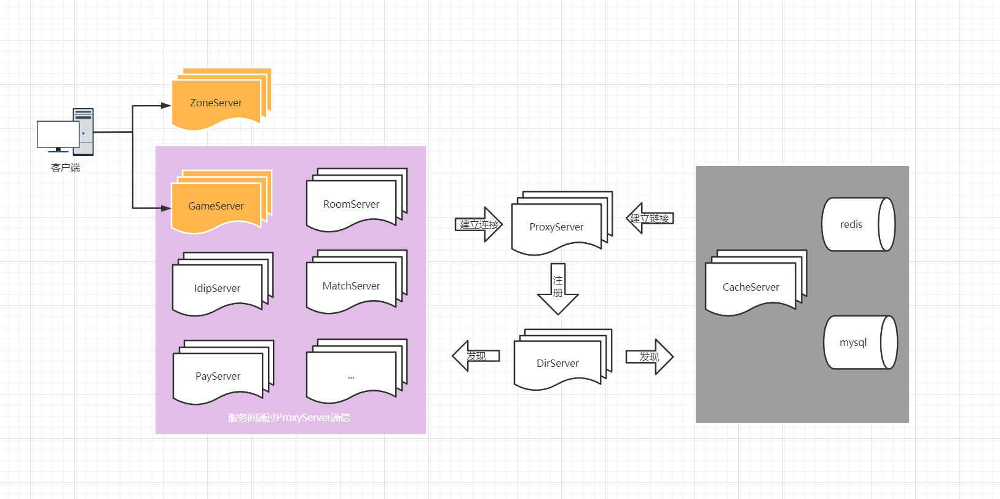

# 游戏服务器

## 一、简介

本项目使用C#语言编写，主要利用了C#的await/async语法糖，将传统的异步回调的写法改为异步同步的写法。

~~服务主要有两个线程，网络线程和逻辑线程，线程间通过无锁队列通信。~~
**已更新为一个主要线程，网络与逻辑合并同一个线程**

项目列表：

1. **Frame**

   服务器的框架库, 将多个服务器中可复用的类分离到本项目
   
2. **DataBase** (即将废弃)

   数据库访问api, 数据库使用的是mysql, 实现了一个K-V模式。

   并发冲突使用乐观锁：每条记录都有版本号字段，不能直接更新数据，必须先取出原数据然后再修改数据，修改时需要和数据库中版本号对比，如果相同则允许修改，如果不同则进制修改。修改成功后记录的版本号+1。

   数据库操作的函数均以异步任务实现。

   <u>尚未完善:</u>:  

   ​	① 数据的二进制需要分段，目前整个二进制都会传输，导致数据变大时数据库操作效率不高。*(将在数据库服务中做)*

   ​	② 自动建表 *(已完成)*

   ​	③ 做专门数据库服务进行缓存，计划是一个GameServer对应一个数据库缓存Server *(在做)*
   
3. **GameServer**

   游戏主逻辑的服务器，客户端将直连此服务。

   已完成功能：登录，创角
   
4. **DirServer**

   目录服务器，所有服务将把自己的服务器类型, 服务器大区(Zone), 服务器id以及ip和端口号注册到此服务。
   已完成注册服务，服务列表拉取，服务列表同步功能(尚未测试)
   
   规划功能： 读写分离，raft选举leader
   
5. **CacheServer** (进行中，替代Database)

   数据库缓存服务，所有服务的数据库操作均走此服务。使用redis + mysql。
   
   规划功能：支持水平切分，定时将redis数据落地至mysql，数据以redis为准。数据操作分段，避免tcp包体过大
   
6. **ProxyServer**

   代理服务，服务间通信都是由此服务转发，以达到解耦效果。

7. **ClientTest**

   模拟客户端发协议，来测试GameServer接口

8. **UnitTest**

   单元测试

## 二、架构图

启动顺序: DirServer -> ProxyServer -> OtherServer

ProxyServer启动时向DirServer注册自己，其他服务启动时与DirServer建立链接，获取ProxyServer的地址，并与ProxyServer建立链接。

服务间通信通过ProxyServer转发。

